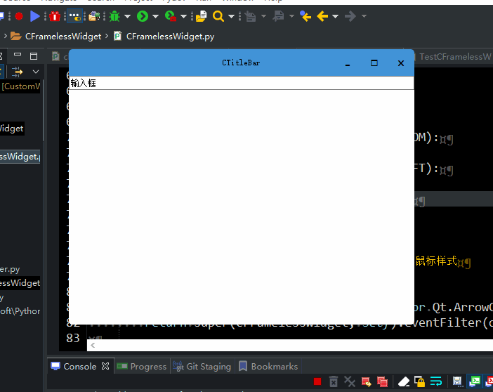
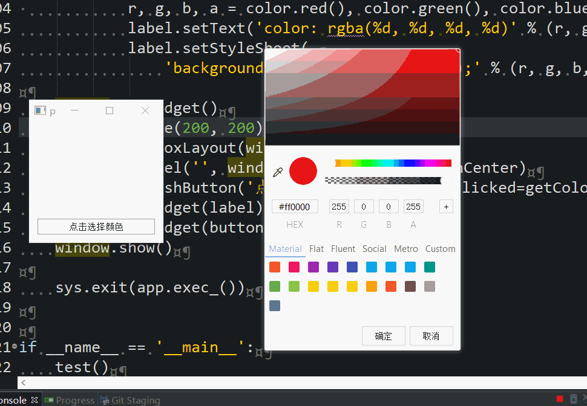
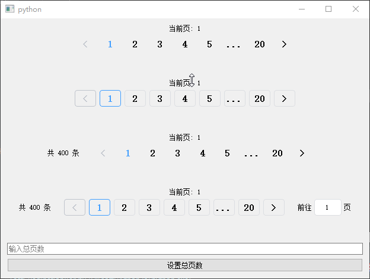
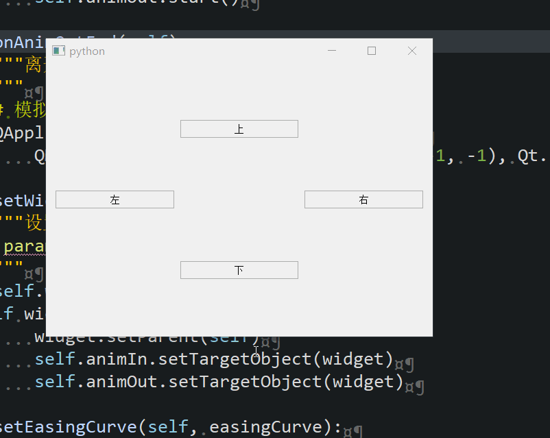
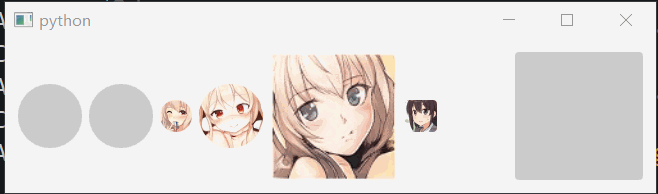
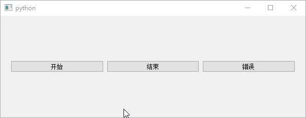
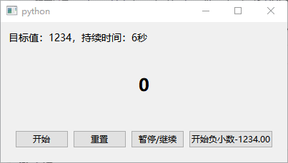

# Components - 组件

## CTitleBar
 - [使用方法](../TestCTitleBar.py)
 - 

## CFramelessWidget
 - [使用方法](../TestCFramelessWidget.py)
 - 

## CColorPicker
 - [使用方法](../TestCColorPicker.py)
 - 

## CPaginationBar
 - [使用方法](../TestCPaginationBar.py)
 - 

## CDrawer
 - [使用方法](../TestCDrawer.py)
 - 

## CAvatar
 - [使用方法](../TestCAvatar.py)
 - 

## CLoadingBar
 - [使用方法](../TestCLoadingBar.py)
 - 

## CCountUp
 - [使用方法](../TestCCountUp.py)
 - 